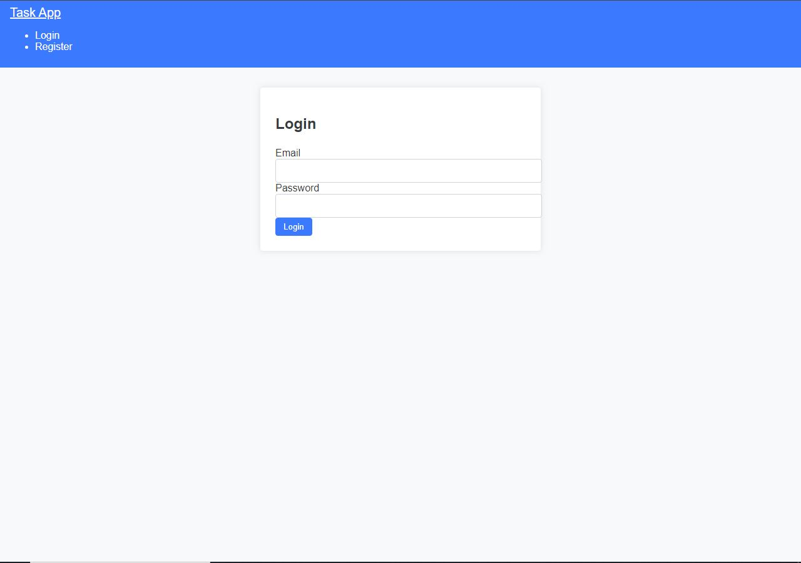
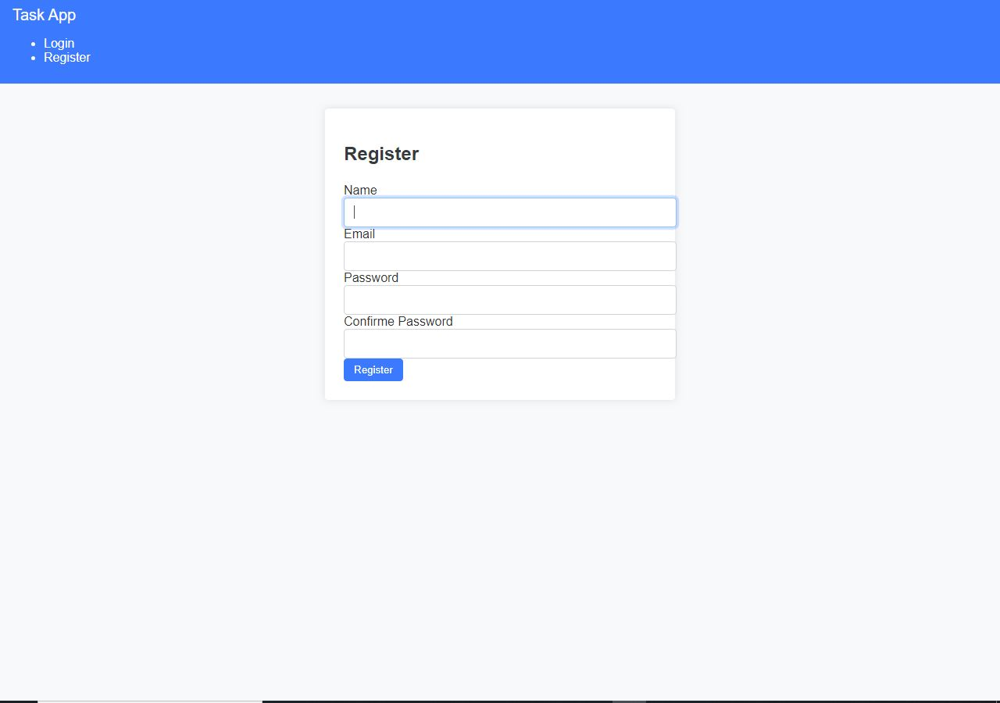
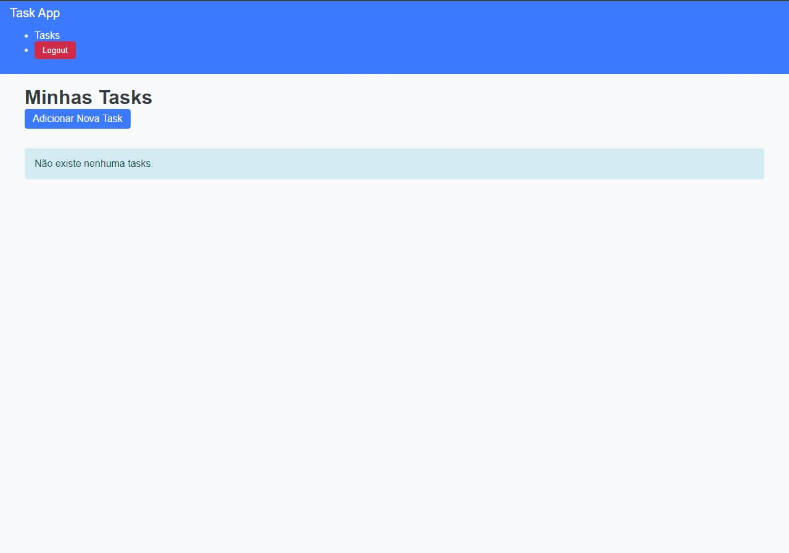
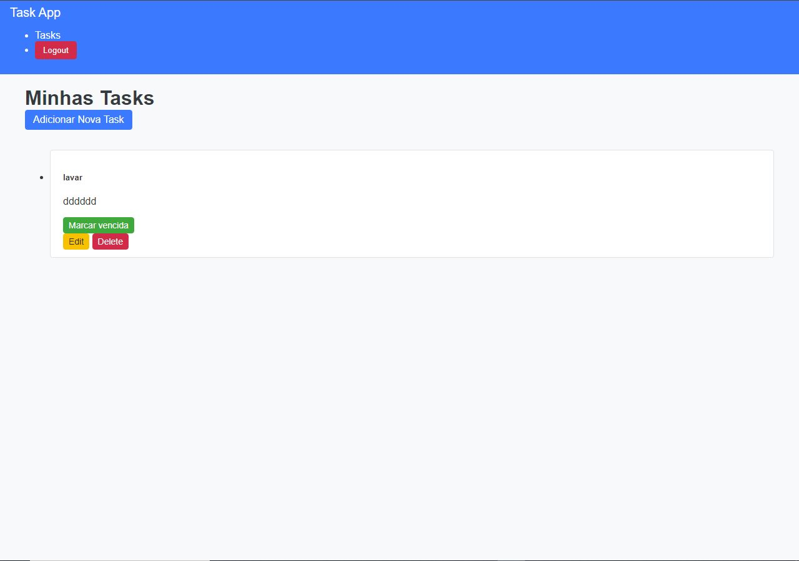

# Mini TaskApp Laravel


## Índice
- [Introdução](#introdução)
- [Funcionalidades](#funcionalidades)
- [Tecnologias Utilizadas](#tecnologias-utilizadas)
- [Instalação](#instalação)
- [Configuração](#configuração)
- [Como Usar](#como-usar)
- [Estrutura do Projeto](#estrutura-do-projeto)
- [Capturas de Tela](#capturas-de-tela)
  - [Tela de Login](#tela-de-login)
  - [Tela de Registro](#tela-de-registro)
  - [Tela de Tarefas](#tela-de-tarefas)
  - [Outras Funcionalidades](#outras-funcionalidades)
- [Contato](#contato)

## Introdução
O **Mini TaskApp Laravel** é um sistema de gerenciamento de tarefas simples e intuitivo, desenvolvido em Laravel. O projeto foi criado com o objetivo de fornecer uma plataforma onde os usuários possam gerenciar suas tarefas diárias de maneira eficiente, com uma interface limpa e funcionalidades essenciais.

## Funcionalidades
- **Registro e Login de Usuário**: Sistema de autenticação com registro de novos usuários.
- **Gerenciamento de Tarefas**: Adicionar, remover, modificar e marcar tarefas como concluídas.
- **Privilégios de Administrador**: Administração de usuários, incluindo a capacidade de remover usuários e suas tarefas associadas.
- **Interface Visual Intuitiva**: Interface que destaca tarefas concluídas de forma visualmente clara.

## Tecnologias Utilizadas
- **Framework**: Laravel
- **Frontend**: HTML, CSS, JavaScript
- **Banco de Dados**: MySQL
- **Outras Ferramentas**: Composer, NPM, Bootstrap

## Instalação
Para instalar e executar o projeto localmente, siga os passos abaixo:

1. Clone o repositório:
   ```bash
       git clone https://github.com/ClaudioCanga/Mini-TaskApp-Laravel.git
2. Acesse o diretório do projeto

       cd Mini-TaskApp-Laravel
3. Instale as dependências do Laravel  

       composer install
4. Instale as dependências do NPM:

       npm install
5. Configure o arquivo .env com suas credenciais de banco de dados.
6. Execute as migrações para criar as tabelas no banco de dados:

       php artisan migrate
7. Inicie o servidor local:
   
       php artisan serve
## Configuração

Certifique-se de configurar o arquivo .env corretamente, incluindo as seguintes variáveis:
 

    DB_CONNECTION=mysql
    DB_HOST=127.0.0.1
    DB_PORT=3306
    DB_DATABASE=nome_do_banco_de_dados
    DB_USERNAME=seu_usuario
    DB_PASSWORD=sua_senha

## Como Usar

1. Acesse a aplicação no navegador utilizando o endereço gerado pelo comando php artisan serve.
Registre-se ou faça login.
2. Após o login, você será redirecionado para a página principal de tarefas, onde poderá gerenciar suas tarefas.

## Estrutura do Projeto
Abaixo está uma visão geral da estrutura do projeto:

    Mini-TaskApp-Laravel/
    ├── app/
    ├── bootstrap/
    ├── config/
    ├── database/
    ├── public/
    │   ├── css/
    │   ├── js/
    │   └── images/
    ├── resources/
    │   ├── views/
    │   ├── css/
    │   ├── js/
    │   └── lang/
    ├── routes/
    │   └── web.php
    ├── storage/
    ├── tests/
    └── vendor/
## Capturas de Tela

### Tela de Login


### Tela de Registro


### Tela de Tarefas


### Outras Funcionalidades

